# SMS Microservices Project

## Overview

The SMS Microservices Project is a Spring Boot-based application that demonstrates a microservices architecture for processing bulk SMS messages. The application allows users to upload an Excel file containing Kenyan phone numbers and SMS messages. The Listener Service validates each phone number, stores all uploaded records, groups valid messages into configurable batches, and publishes them to RabbitMQ. The Sender Service consumes the queued batches, simulates SMS delivery, and records delivery results in its own database.

This project demonstrates several core microservices concepts, including asynchronous communication, service separation, message queuing, batch processing, and the database-per-service design pattern.

---

# Table of Contents

- Overview
- Features
- System Architecture
- Technologies Used
- Project Structure
- Application Workflow
- Phone Number Validation
- Running the Application
- Application Walkthrough
- Processing When the Sender Service is Offline
- RabbitMQ Queue Demonstration
- Database Records
- Batch Processing
- REST API
- Future Improvements
- Author
- License

---

# Features

- Upload SMS records from an Excel (.xlsx) file
- Validate Kenyan phone numbers
- Reject invalid phone numbers
- Batch valid SMS messages before processing
- Asynchronous communication using RabbitMQ
- Independent SMS Listener and SMS Sender microservices
- Separate H2 databases for each microservice
- RESTful APIs for uploading and monitoring SMS processing
- SMS delivery simulation with logging
- Queue persistence when the Sender Service is unavailable

---

# System Architecture

```
                        +------------------------+
                        |      User Uploads      |
                        |      Excel File        |
                        +-----------+------------+
                                    |
                                    |
                                    v
                  +-----------------------------------+
                  |     SMS Listener Service          |
                  |           Port 8081               |
                  +-----------------------------------+
                  |                                   |
                  | Read Excel File                   |
                  | Validate Phone Numbers            |
                  | Save Upload Records               |
                  | Create SMS Batches                |
                  | Publish to RabbitMQ              |
                  +----------------+------------------+
                                   |
                                   |
                                   v
                        +----------------------+
                        |      RabbitMQ        |
                        |      sms.queue       |
                        +----------+-----------+
                                   |
                                   |
                                   v
                 +------------------------------------+
                 |      SMS Sender Service            |
                 |           Port 8082                |
                 +------------------------------------+
                 |                                    |
                 | Consume Message Batches            |
                 | Simulate SMS Delivery              |
                 | Store Delivery Logs                |
                 +----------------+-------------------+
                                  |
                                  |
                                  v
                        +----------------------+
                        |   Sender Database    |
                        +----------------------+
```

---

# Technologies Used

| Technology | Purpose |
|------------|---------|
| Java 21 | Programming Language |
| Spring Boot | Backend Framework |
| Spring Web | REST APIs |
| Spring Data JPA | Database Operations |
| Spring AMQP | RabbitMQ Integration |
| RabbitMQ | Message Broker |
| Apache POI | Excel Processing |
| H2 Database | In-memory Database |
| Maven | Dependency Management |
| Lombok | Reduce Boilerplate Code |

---

# Project Structure

```
sms-microservices/
│
├── sms-listener/
│   ├── controller/
│   ├── service/
│   ├── repository/
│   ├── model/
│   ├── config/
│   └── resources/
│
├── sms-sender/
│   ├── controller/
│   ├── service/
│   ├── repository/
│   ├── model/
│   ├── config/
│   └── resources/
│
├── images/
│
└── README.md
```

The project is divided into two independent microservices:

### SMS Listener Service

Responsible for:

- Reading uploaded Excel files
- Validating Kenyan phone numbers
- Storing uploaded records
- Creating configurable SMS batches
- Publishing message batches to RabbitMQ

### SMS Sender Service

Responsible for:

- Consuming queued message batches
- Simulating SMS delivery
- Logging successful and failed deliveries
- Maintaining SMS delivery records

RabbitMQ acts as the communication layer between the two services, enabling asynchronous processing while keeping both services loosely coupled.

# Application Workflow

The application follows an asynchronous processing workflow where SMS messages are validated, queued, and processed independently by two microservices.

## Step 1: Upload an Excel File

The user uploads an Excel file containing two columns:

| Phone Number | Message |
|--------------|---------|
|254712345678|Hello from SMS system!|
|254723456789|This is a test message|
|254734567890|Another test message|

The uploaded file is received by the SMS Listener Service.

---

## Step 2: Phone Number Validation

Each uploaded phone number is validated before processing.

A phone number is considered valid if it:

- Starts with `254`
- Contains exactly 12 digits
- Contains only numeric characters

### Example

| Phone Number | Status |
|--------------|--------|
|254712345678|Valid|
|254723456789|Valid|
|0712345678|Invalid|
|254123|Invalid|

Invalid phone numbers are stored in the Listener database but are never forwarded to the Sender Service.

---

## Step 3: Batch Creation

After validation, all valid SMS records are grouped into configurable batches.

For this implementation:

- Batch Size: **15 SMS messages**

If the uploaded file contains 50 valid phone numbers, the Listener Service creates four separate batches before publishing them to RabbitMQ.

Batch processing improves performance by reducing communication overhead between services.

---

## Step 4: Publishing to RabbitMQ

Each SMS batch is published to RabbitMQ using the `sms.queue`.

RabbitMQ acts as the communication layer between the two microservices.

Advantages include:

- Asynchronous communication
- Loose coupling
- Reliable message delivery
- Fault tolerance
- Queue persistence

---

## Step 5: SMS Processing

The Sender Service continuously listens for incoming batches.

Whenever a batch becomes available:

- The batch is consumed.
- SMS delivery is simulated.
- Successful messages are logged.
- Failed messages are recorded with their status.

---

## Step 6: Data Storage

Both services maintain independent databases.

### Listener Database

Stores:

- Uploaded phone number
- SMS message
- Validation status
- Validation message
- Upload timestamp
- Processing timestamp

### Sender Database

Stores:

- Phone number
- SMS message
- Delivery status
- Error message
- Delivery timestamp

This demonstrates the **Database per Service** microservices pattern.

---

# Running the Application

## Prerequisites

Ensure the following software is installed before running the project.

| Software | Version |
|----------|---------|
| Java | 21 |
| Maven | Latest |
| RabbitMQ | Latest |
| Git | Latest |

---

## Clone the Repository

```bash
git clone https://github.com/yourusername/sms-microservices.git

cd sms-microservices
```

---

## Start RabbitMQ

Ensure RabbitMQ is running before starting either microservice.

Default RabbitMQ URL:

```
http://localhost:15672
```

Default Credentials

Username

```
guest
```

Password

```
guest
```

---

## Start the SMS Listener Service

```bash
cd sms-listener

mvn spring-boot:run
```

Runs on

```
http://localhost:8081
```

---

## Start the SMS Sender Service

```bash
cd sms-sender

mvn spring-boot:run
```

Runs on

```
http://localhost:8082
```

---

# REST API

## SMS Listener Service

### Upload Excel File

```
POST /api/sms/upload
```

Uploads an Excel file containing phone numbers and SMS messages.

---

### Validate Phone Number

```
GET /api/sms/validate/{phoneNumber}
```

Returns whether the supplied phone number is valid.

---

### View Uploaded Requests

```
GET /api/sms/requests
```

Returns every uploaded SMS request.

---

### View Requests by Status

```
GET /api/sms/requests/status/{status}
```

Example:

```
VALID
```

or

```
INVALID
```

---

## SMS Sender Service

### Send SMS

```
POST /api/sms/send
```

Simulates sending an SMS.

---

### View SMS Logs

```
GET /api/sms/logs
```

Returns every SMS delivery record.

---

### View Logs by Status

```
GET /api/sms/logs/status/{status}
```

Example

```
SENT
```

or

```
FAILED
```

---

### Search Logs by Phone Number

```
GET /api/sms/logs/phone/{phoneNumber}
```

Returns all SMS delivery records associated with the supplied phone number.

---
# Application Walkthrough

This section demonstrates how users interact with the application, from uploading an Excel file to viewing processing results and delivery logs.

---

## Landing Page

The landing page is the first interface presented to users when accessing the application. It provides a simple and intuitive interface for uploading an Excel file containing phone numbers and SMS messages for processing.

Users only need to select a valid Excel file and submit it to begin the SMS processing workflow.

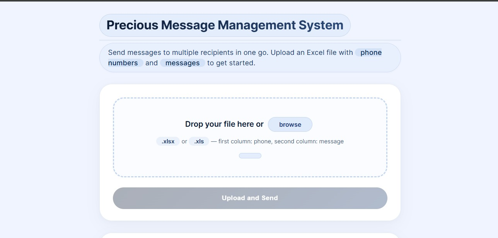

---

## Uploading an Excel File

After selecting an Excel file, the application displays the uploaded file before processing begins. This allows the user to confirm that the correct file has been selected before initiating validation and SMS processing.

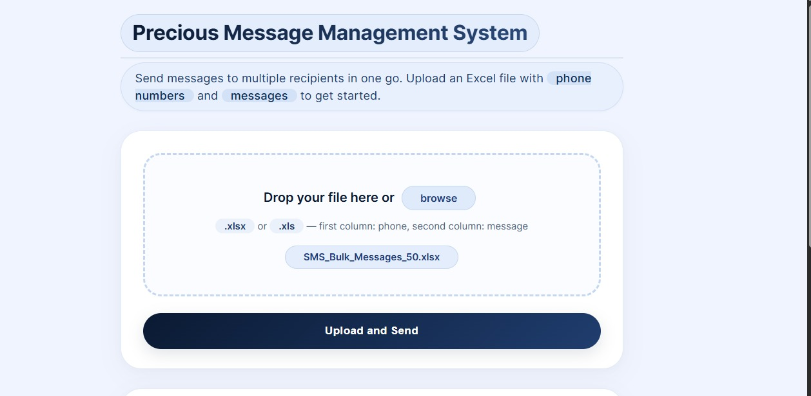

---

## Logs Before Processing

Before any file is uploaded during a session, the log section is empty since no SMS processing has taken place.

The log panel begins recording processing information only after the first upload.

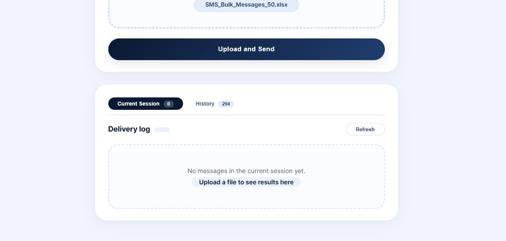

---

## File Analysis

Once the uploaded Excel file has been processed, the application generates a summary showing the overall processing results.

The analysis includes:

- Total number of uploaded records
- Number of valid Kenyan phone numbers
- Number of invalid phone numbers
- Number of successfully sent messages
- Number of failed messages

This summary allows users to immediately determine whether their upload was processed successfully and identify any invalid phone numbers.

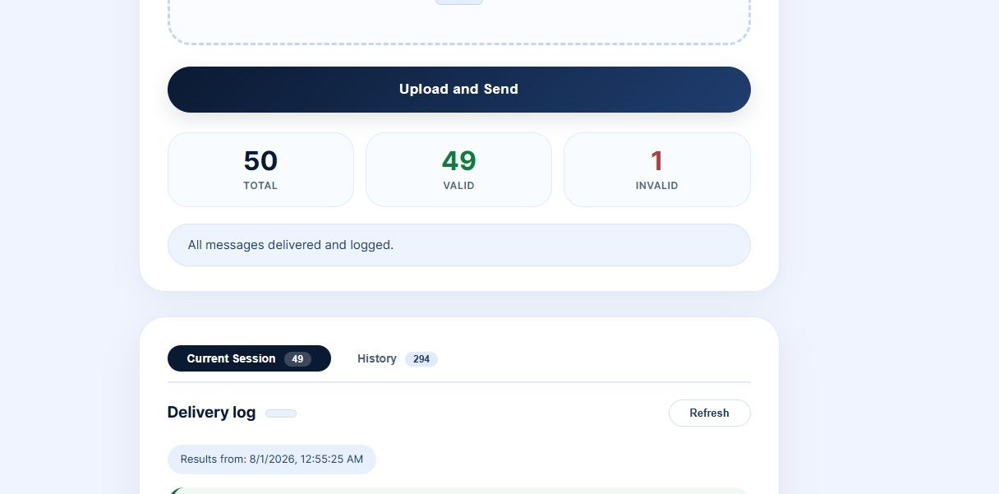

---

## Current Session Logs

After processing is complete, the application's log panel is updated with detailed information regarding the uploaded file.

The current session log provides information such as:

- Validation progress
- Queue publishing
- SMS delivery status
- Processing completion

Every upload performed during the active session is appended to this log.

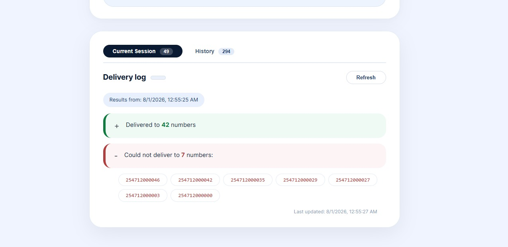

---

## Upload History

The History section maintains a record of every Excel file uploaded during the current application session.

Unlike the current session log, which displays processing events, the History section provides a summarized record of all uploaded files, allowing users to review previous uploads without reprocessing them.

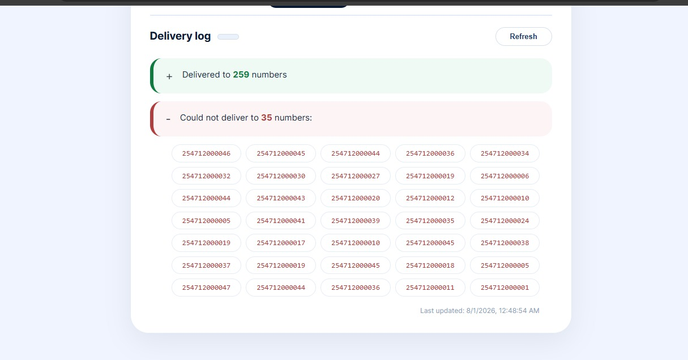

---

# Processing When the Sender Service Is Offline

One of the primary advantages of using RabbitMQ is that the application remains operational even when the SMS Sender Service becomes unavailable.

When the Sender Service is offline:

- Users can continue uploading Excel files.
- Phone numbers are still validated.
- Invalid numbers are rejected immediately.
- Valid SMS messages are successfully queued in RabbitMQ.
- The user is notified that the Sender Service is currently unavailable.
- No SMS messages are lost.
- Once the Sender Service becomes available again, RabbitMQ automatically delivers all queued messages for processing.

This demonstrates the fault-tolerant nature of asynchronous communication using message queues.

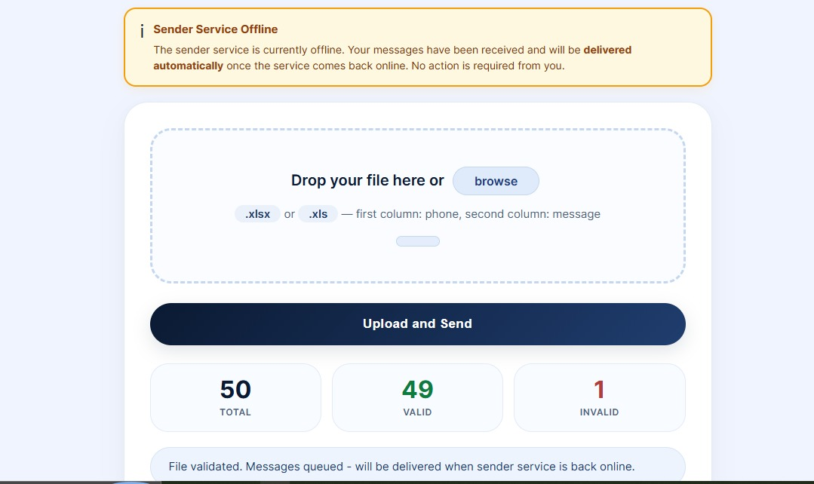

---

## RabbitMQ Queue While the Sender Service Is Offline

The RabbitMQ Management Console confirms that SMS batches remain safely stored while the Sender Service is unavailable.

Since no consumer is connected to the queue, RabbitMQ retains every published batch until the Sender Service reconnects.

This ensures reliable message delivery even during temporary service outages.

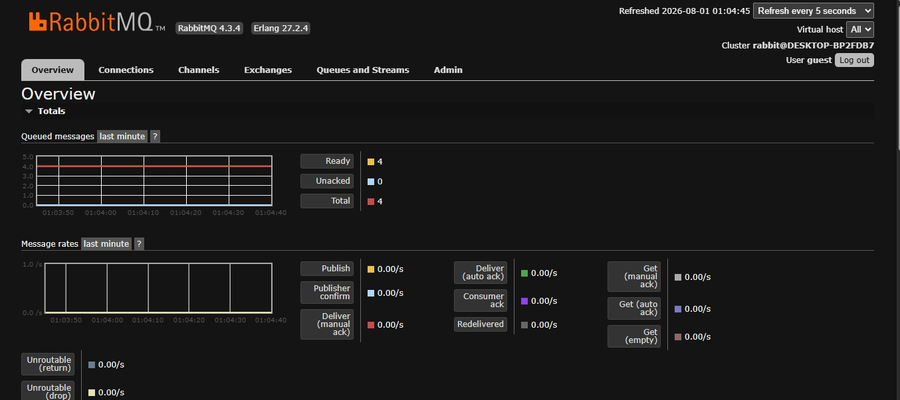

---

# RabbitMQ Queue Demonstration

RabbitMQ provides asynchronous communication between the SMS Listener Service and the SMS Sender Service.

Instead of communicating directly, the Listener Service publishes message batches to RabbitMQ, allowing the Sender Service to process them independently.

This design improves scalability, reliability, and fault tolerance.

---

## Listener Service Active While Sender Service Is Offline

The image below shows RabbitMQ while only the Listener Service is running.

During this period:

- The Listener Service continues accepting uploaded files.
- Phone numbers are validated successfully.
- Valid SMS records are grouped into batches.
- Every batch is published to the `sms.queue`.
- Since no consumer exists, RabbitMQ retains every batch until a consumer reconnects.

No messages are lost while the Sender Service remains offline.

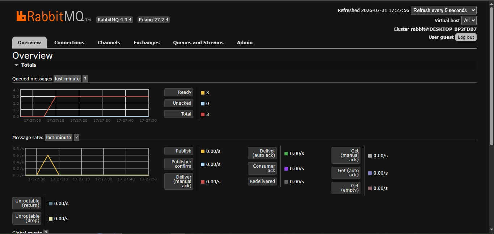

---

## Sender Service Reconnected

When the Sender Service starts again, RabbitMQ automatically detects the available consumer.

The queued SMS batches are consumed in the same order they were published.

As each batch is processed:

- Messages are removed from the queue.
- SMS delivery is simulated.
- Delivery logs are stored in the Sender database.
- The queue size decreases until every pending message has been processed.

This demonstrates RabbitMQ's ability to guarantee reliable asynchronous message delivery even after temporary consumer downtime.

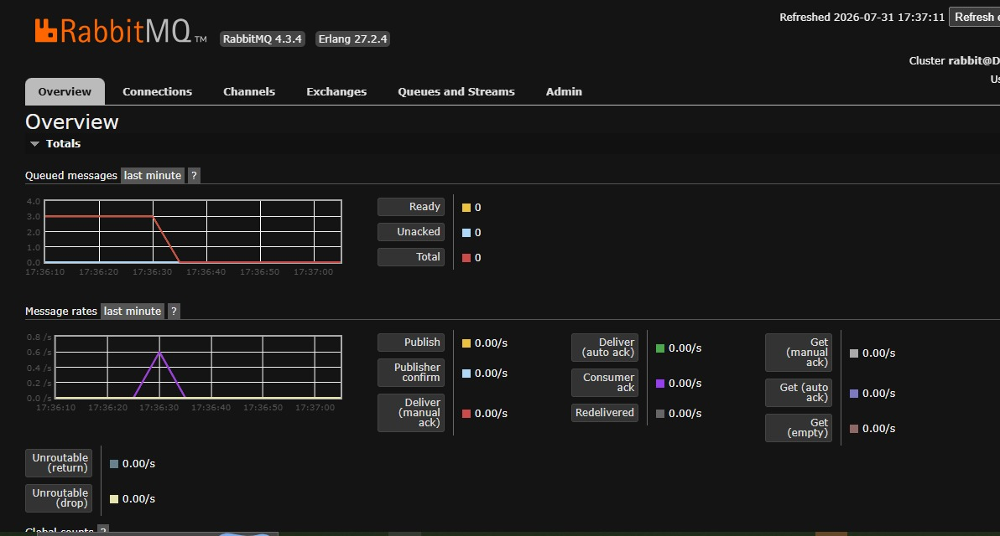

---
# Database Records

The SMS Microservices Project follows the **Database per Service** architectural pattern, where each microservice maintains its own independent database. This design promotes loose coupling, improves scalability, and allows each service to evolve independently without affecting the other.

---

## SMS Listener Service Database

The Listener Service is responsible for processing every uploaded Excel file.

For each uploaded record, it performs phone number validation before deciding whether the message should be forwarded to RabbitMQ.

The Listener database stores every uploaded record, including:

- Phone number
- SMS message
- Validation status
- Validation message
- Upload timestamp
- Processing timestamp

Unlike the Sender Service, the Listener database records **both valid and invalid phone numbers**.

The image below shows a snapshot of the Listener Service database after several uploads.

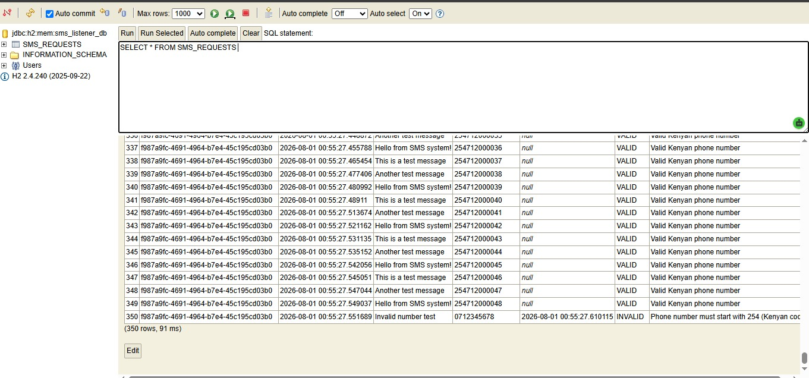

---

## SMS Sender Service Database

The Sender Service receives only validated SMS batches from RabbitMQ.

For every SMS processed, it stores:

- Phone number
- SMS message
- Delivery status
- Error message (if applicable)
- Delivery timestamp

Since invalid phone numbers are filtered out by the Listener Service, the Sender database contains **only valid SMS records**.

The image below shows a snapshot of the Sender Service database.

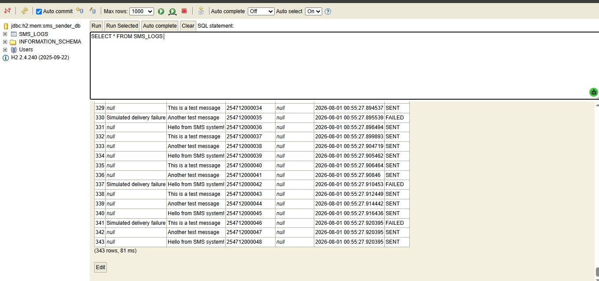

---

## Why Do the Database Record Counts Differ?

You may notice that the number of records stored in both databases is different.

For example:

| Service | Number of Records |
|----------|-------------------|
| Listener Service | **350** |
| Sender Service | **343** |

This difference is expected.

The Listener Service stores **every phone number** uploaded by the user, regardless of whether it is valid or invalid.

The Sender Service only receives and stores **valid Kenyan phone numbers** after validation has been completed.

As a result, invalid phone numbers never reach the Sender Service database.

This demonstrates the separation of responsibilities between the two microservices:

- The Listener Service is responsible for **validation and message publishing**.
- The Sender Service is responsible only for **processing valid SMS messages**.

---

# Batch Processing Demonstration

To improve performance and reduce communication overhead, valid SMS messages are grouped into configurable batches before being published to RabbitMQ.

For this implementation:

- Batch Size: **15 SMS messages**
- Test Excel File: **50 records**

After validating the uploaded file, the Listener Service automatically divided the valid records into **four batches**.

The batches were then published sequentially to RabbitMQ.

As soon as the Sender Service consumed a batch, it immediately began processing the SMS messages before retrieving the next batch.

This batching strategy reduces the number of RabbitMQ publish operations while maintaining efficient message processing.

---

## Batch Processing Terminal Output

The terminal output below illustrates the batching process performed by both services.

The Listener Service:

- Creates SMS batches.
- Publishes each batch to RabbitMQ.

The Sender Service:

- Consumes each batch.
- Simulates SMS delivery.
- Logs successful and failed deliveries.

The terminal output confirms that all four batches were successfully published and consumed.

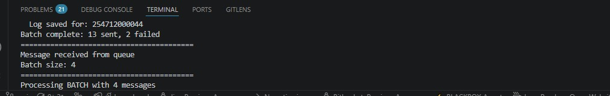

---

# Microservices Concepts Demonstrated

This project demonstrates several important concepts used in modern distributed systems.

## Service Separation

The application is divided into two independent microservices.

Each service has a clearly defined responsibility.

- Listener Service
  - File upload
  - Validation
  - Batch creation
  - Queue publishing

- Sender Service
  - Queue consumption
  - SMS delivery simulation
  - Delivery logging

---

## Database per Service

Each microservice maintains its own database.

This eliminates direct database sharing and improves service independence.

---

## Asynchronous Communication

The Listener Service does not communicate directly with the Sender Service.

Instead, RabbitMQ acts as an intermediary message broker.

This allows both services to execute independently.

---

## Message Queuing

RabbitMQ guarantees reliable message delivery.

Messages remain safely stored whenever the Sender Service is unavailable.

Once the Sender Service reconnects, queued messages are processed automatically.

---

## Batch Processing

Rather than sending one SMS message at a time, the Listener Service groups multiple messages into batches.

Benefits include:

- Reduced communication overhead
- Improved throughput
- Better scalability
- Faster processing

---

## Fault Tolerance

The application continues accepting uploads even when the Sender Service is offline.

RabbitMQ stores pending SMS batches until the consumer becomes available again.

No messages are lost during temporary service failures.

---

## Scalability

Because the Listener and Sender services are independent, additional Sender Service instances can be introduced in the future to process SMS batches concurrently.

This allows the application to scale horizontally as message volume increases.

---